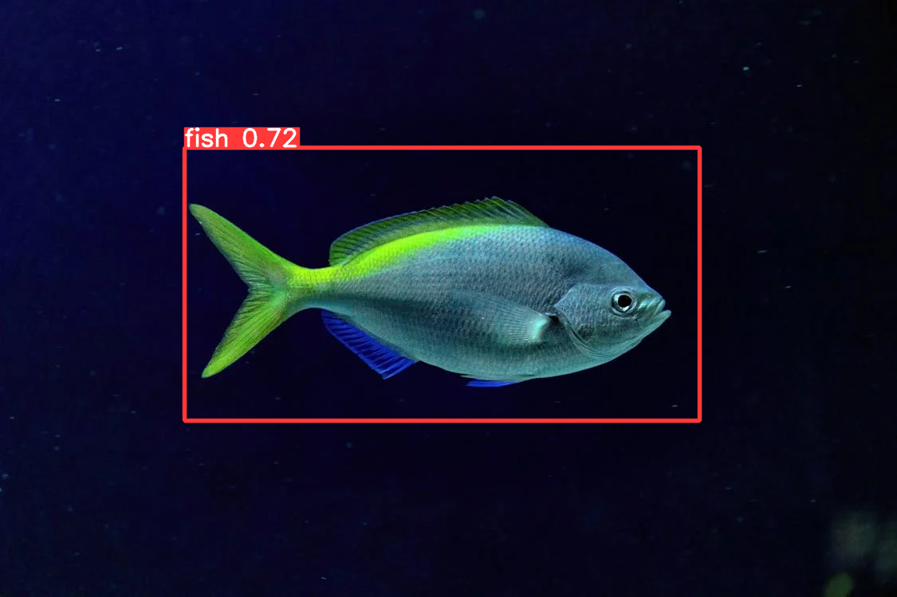

# Fish Detection
The Fish Detection project is designated to the 2024 course of [IDATG2206 - Computer Vision](https://www.ntnu.no/studier/emner/IDATG2206#tab=omEmnet) at [NTNU](https://www.ntnu.edu/). It is a project about fish classification in videos and images.

## General Navigation
- [Project Structure](#project-structure)
- [Task Description](./docs/task_description.pdf)
- [Installation](./docs/installation.md)
- [Experimentations](./docs/experimentations/README.md)
- [Disclaimers](#disclaimers)
- [Resources](#resources)
- [Licenses](#licenses)

## Project structure
Due to the nature of research and experimentations, the project is an organised chaos with many subprojects. For this reason, most of our code reside in [*experimentations*](./experimentations/). The directory is further organised in the following categories:

- [Computer Vision Methods](./experimentations/computer_vision_methods/)
- [Data Preparations](./experimentations/data_preparations/)
- [Deep Learning](./experimentations/deep_learning/)

*Computer Vision [CV] Methods* consist of scripts with classical CV methods for image classifications. *Data Preparations* and *Machine Learning* (a somewhat misinterpreted name) are part of our deep learning experimentations where we prepare a dataset to feed a deep learning model.

## Installation
As this project's [experiments](./experimentations/) differ in goals and purpose, they have different dependencies. However, they commonly use Python. To setup a compatible Python installation, please follow the [installation](./docs/installation.md) for instructions.

## Disclaimers
The project is authored by a group of bachelor students. It started out as a private object, but was later made public. This is largely due to the licensing terms of [Ultalytics](https://docs.ultralytics.com/) that uses [AGPL](https://github.com/ultralytics/ultralytics/blob/main/LICENSE), but also for other reasons. This means that even if we have made our best attempt to ensure attributions and credits where they are due, we are humans and we make mistakes. If you encounter legal mistakes which we have made, please get in touch with us via the [issues](https://github.com/asiangoldfish/NTNU_ComputerVIsion/issues) board.

## Resources
*Informal list of reference resources used in the project:*
- https://link.springer.com/article/10.1007/s11831-020-09486-2
- https://arxiv.org/abs/1902.00267
- https://realpython.com/python-opencv-color-spaces/
- https://realpython.com/python-opencv-color-spaces/
- https://towardsdatascience.com/understand-and-visualize-color-spaces-to-improve-your-machine-learning-and-deep-learning-models-4ece80108526
- https://se.mathworks.com/help/images/understanding-color-spaces-and-color-space-conversion.html
- https://ntnuopen.ntnu.no/ntnu-xmlui/handle/11250/2639552

*Research papers*:
- Belongie, S., Malik, J. and Puzicha, J. (2002). Shape matching and object recognition using shape contexts. IEEE Transactions on Pattern Analysis and Machine Intelligence, 24 (4), pp.509–522. [Online]. Available at: doi:10.1109/34.993558 [Accessed 23 February 2024].
- Cisar, P. et al. (2021). Computer vision based individual fish identification using skin dot pattern. Scientific reports, 11 (1), p.16904. [Online]. Available at: doi:10.1038/s41598-021-96476-4 [Accessed 23  ebruary 2024].
- Mishra, A. (2023). Decoding the Technology Behind Tesla Autopilot: How it Works. [Online]. Medium. Available at: https://ai.plainenglish.io/decoding-the-technology-behind-tesla-autopilot-how-it-works-af92cdd5605f [Accessed 23 February 2024].
- Myrum, E. et al. (2019). An automatic image-based system for detecting wild and stocked fish.
- Zhang, Y. and Wu, L. (2012). Classification of Fruits Using Computer Vision and a Multiclass Support Vector Machine. Sensors, 12 (9), pp.12489–12505. [Online]. Available at: doi:10.3390/s120912489.

## Legal

### Attributions
- Photo by Antonio Friedemann from Pexels: https://www.pexels.com/photo/blue-and-green-fish-underwater-11633338/
- Kathuria, Ayoosh: https://github.com/ayooshkathuria/YOLO_v3_tutorial_from_scratch