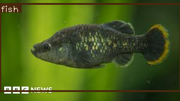
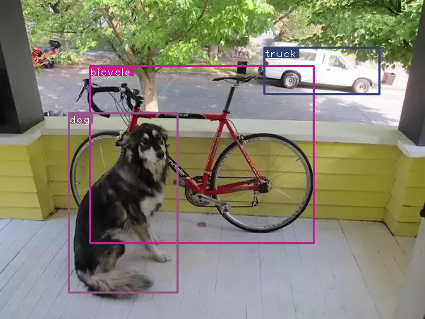

# Fish Classification with YOLO

Fish detection and classification:



License: [bbc.co.uk – © copyright 2021 BBC](https://www.bbc.com/news/science-environment-59760356)

Also tested on other classes!



Attribution: [Ayoosh Kathuria](https://github.com/ayooshkathuria/YOLO_v3_tutorial_from_scratch?ref=blog.paperspace.com)

YOLO (You Only Look Once) is a popular object detection algorithm, known for
its performance. It is a single-pass algorithm and can also be used for
in real-time applications (like surveillance cameras).

In this project, the model is implemented from scratch using PyTorch, a popular
Python framework for artificial intelligence. The original code is from
[Ayoosh Kathuria](https://github.com/ayooshkathuria/YOLO_v3_tutorial_from_scratch?ref=blog.paperspace.com).
The reason why this is implemented from scratch is for learning purpose. In-depth
study in deep learning is out of scope for our course and project, but this has
greatly contributed to my (mine as in [Khai](https://github.com/asiangoldfish)'s)
understanding of artificial neural networks.

## Project Structure
The most import files for the fish detection algorithm are as follows:
- [detect.py](./detect.py): The entry script. Execute this script to perform
  fish detection.
- [darknet.py](./darknet.py): The YOLO model using the Darknet framework. It
  contains the neural network architecture and handles parsing *.cfg* files.
- [util.py](./util.py): Helper script containing utility functions for the
  Darknet implementation.
- [cfg/](./cfg/): Directory containing all configuration files for the YOLO
  model. These files contain meta data about the CNN architecture.

Other files:
- [pallete](./pallete): Binary files that contains a list of arbitrary colours.
  Used for applying different colours to bounding boxes in the detection.

## Dependencies
The model relies on pre-trained weights. Currently, we have tested the following
datasets:
- [deepfish](https://drive.google.com/file/d/1iHPFbqo-B2iVytusHic9s8VuMlLIMu5-/view)
- [merge](https://drive.google.com/file/d/1abQbj2JhvRNIDNug3FcBzqYYwUEOchfZ/view)

The above datasets were found in [Abdullah Al Muksit](https://github.com/tamim662)'s
GitHub repository [YOLO-Fish](https://github.com/tamim662/YOLO-Fish), and we
have found that the *merge* dataset works the best for us. You can download the
pre-trained weights from Muksit's repository, or directly from [this link](https://drive.google.com/drive/folders/1BmBdxwGCH3IS0kTeDxK2hT8vVvEtd_3o) (download *merge_yolo3.weights*).

Furthermore, the following Python dependencies are required:
- Python3.9 (this needs to be the exact major version. We have tested this with
  version 3.9.19. This is due to OpenCV compatibility)
- Libraries:
  ```
  torch, numpy, opencv-python, matplotlib, pandas, ipykernel
  ```

You can install the libraries manually using pip, or via the provided
*requirements.txt*:
```
pip install -r requirements.txt
```

## Compatibility
### Operating Systems
This project has been tested on the following platforms:

*Linux:*
- Pop!_OS 22.04 LTS

### Development Platforms
This project has been tested on the following development platforms:
- Visual Studio Code (1.87.2)

## Usage
[*detec.py*](./detect.py) has default settings that do not work. Therefore you
should provide at least the following flags:

- *--images*: Path to the image to object detect
- *--weights*: Path to the .weights file. This contains pre-trained weights.
- *--cfg*: Path to the .cfg file. This contains metadata for the convolutional
  neural network.
- *--det*: Output directory

Example:
```sh
python detect.py --det det --cfg cfg/yolov3-1-class.cfg --weights weights/merge_yolov3.weights --images fish_img/bbc_undestinct.png
```

The example above assumes you have downloaded the *merge* dataset's weights and used an arbitrary fish image, in my case it's the fish from BBC on top of
this README.


## Attributions
- The original source code for this project is from [Ayoosh Kathuria](https://blog.paperspace.com/author/ayoosh/)
at [blog.paperspace.com](https://blog.paperspace.com/how-to-implement-a-yolo-object-detector-in-pytorch/).
While his tutorial is openly available on the internet, his project is not
licensed. This attribution serves as a credit to his work.
- *Deepfish* and *merge* weights were found at [Abdullah Al Muksit](https://github.com/tamim662)'s
GitHub repository [YOLO-Fish](https://github.com/tamim662/YOLO-Fish).
